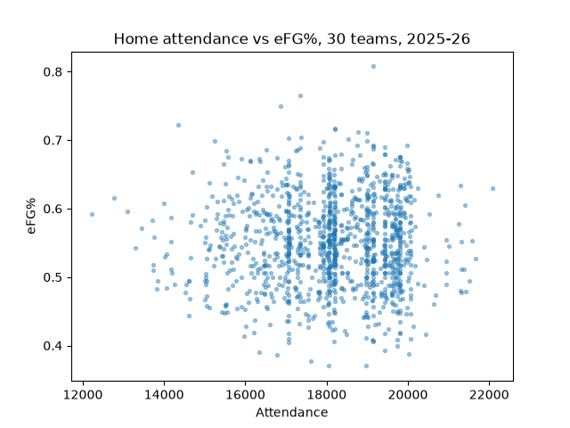

# NBA-attendance-efg
Controlling for opponent strength, does home attendance relate to shooting efficiency in the NBA?

Attendance at NBA games can sometimes feel like the make or break. How loud a crowd is, how much spirit they bring, what they chant, cheer and boo, all of that should matter, shouldn't it? I found no detectable relationship between home attendance and shooting efficiency. Even taken at face value, the estimated effect was tiny, on the order of half a point of eFG% between a quiet arena and a packed one, smaller than normal game-to-game noise. Opponent quality, however, had a strong negative relationship with home shooting efficiency, better opponents suppress it, which gave me confidence the method was capable of finding a real signal when one existed.

## Data
I used Basketball Reference data for all 30 NBA teams during the 2025-26 regular season. The final dataset contains 1,228 home games. I pulled:

- Team game logs for shooting data
- Team schedules for attendance
- Simple Rating System (SRS) ratings for opponent quality

The CSV files were exported by hand from Basketball Reference and saved in `data/`. I cleaned the files, standardized team and date fields, and merged the sources into one game-level dataset, game logs to schedules on date within each team, then SRS onto each game by opponent code. Two teams show 40 true home games rather than 41 because of neutral-site NBA Cup games (more on that below).

## Results
I estimated two linear regression models. The first looks only at attendance and home-team eFG%. The second adds opponent SRS as a control for opponent quality.

| Model | attend_k coef | attend_k p | SRS coef | SRS p |
|---|---|---|---|---|
| Naive (attendance only) | 0.00035 | 0.774 | — | — |
| Controlled (+ SRS) | 0.00088 | 0.466 | -0.00227 | 3.6e-13 |

*attend_k is attendance in thousands, so 0.00088 ≈ +0.09 percentage points of eFG% per 1,000 extra fans.*

The attendance coefficient was statistically insignificant and very small in practical terms in both models. Teams shot worse against stronger opponents, and that relationship was statistically strong. I believe the attendance null is more credible because the same model was able to detect that much clearer basketball effect. I expected the naive model to show a misleading correlation, big crowds show up for good opponents, that the control would then remove. Instead there was no relationship even before controlling: the surprise was that there was nothing to un-confound.

## Method decisions
I added assertions that crash the program if a merge changes the row count, because I wanted the script to stop instead of letting me keep going with bad data. I had already run into bad pastes and strange game counts, so I wanted those mistakes caught before anything got committed.

After computing eFG% from the raw shooting columns, I printed my values next to Basketball Reference's own eFG% column. Matching them on every row confirmed I had pulled the right columns and that the formula and merge were working correctly, a check on the whole pipeline, not just one number.

A per-team count of home games surfaced two anomalies: the Knicks showed 40 home games and the Magic showed 42, which shouldn't be possible since every team is the designated home team 41 times. Tracing the dates, the extra and missing games were NBA Cup knockout games played at a neutral site in Las Vegas, Basketball Reference lists the home-designated team as if it were a true home game. I added a `NEUTRAL_SITE` dictionary to flag and exclude those games, so any future neutral-site game is a one-line addition instead of a code change.

## Limitations
- One season of data (2025-26). More seasons would tighten the estimates.
- Raw attendance doesn't capture how full or loud an arena actually was, because arenas differ in size — 15,000 fans is nearly a sellout in Memphis and a quiet night in Chicago. Attendance divided by capacity would better measure the crowd environment, and is the first thing I'd add.
- The data was hand-exported from Basketball Reference, and several files arrived wrong (a wrong-table paste, duplicated rows, a missing header). The assertions and per-team counts caught these, but hand collection remains a source of risk.

## How to run
1. Clone this repo
2. `pip install -r requirements.txt`
3. `python pilot.py`

The CSVs in `data/` were exported by hand from Basketball Reference; the script cleans, merges, and runs both regressions, printing results and saving the scatter plot.
